# Introducció a Blockchain

---

## La pregunta

- Com podem mantenir un **registre digital compartit** entre múltiples participants?
- Sense confiar en:
  - un **servidor central**
  - una **autoritat única**
- Però assegurant:
  - integritat
  - coherència
  - resistència a manipulacions

---

## Sistemes centralitzats

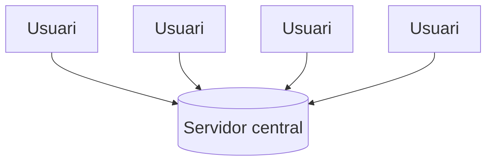

Problemes:

- punt únic de fallada
- censura
- manipulació possible
- dependència d'una autoritat

---

## Sistema descentralitzat

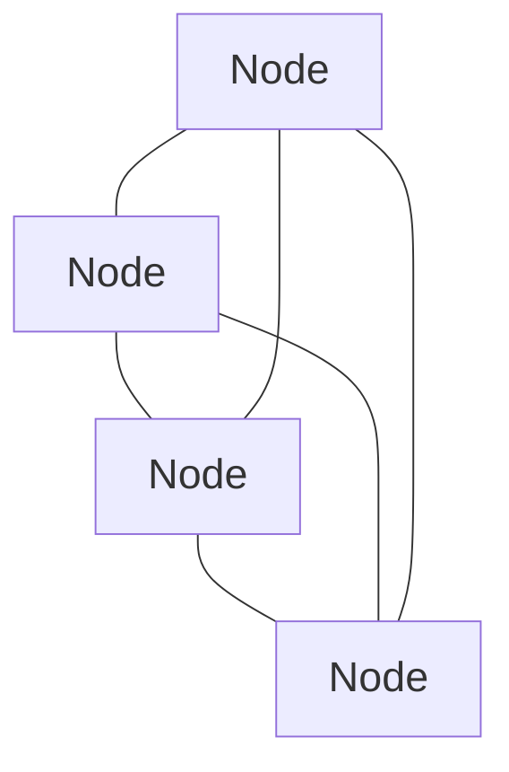

Característiques:

- cada node té una còpia del registre
- verificació distribuïda
- sense autoritat central

---

# Bitcoin

---

## Bitcoin

- Primera aplicació de **blockchain**
- Proposada el **2008**
- Autor: **Satoshi Nakamoto**

Objectiu:

> Sistema de **pagament electrònic peer-to-peer**

---

## Flux d'una transacció

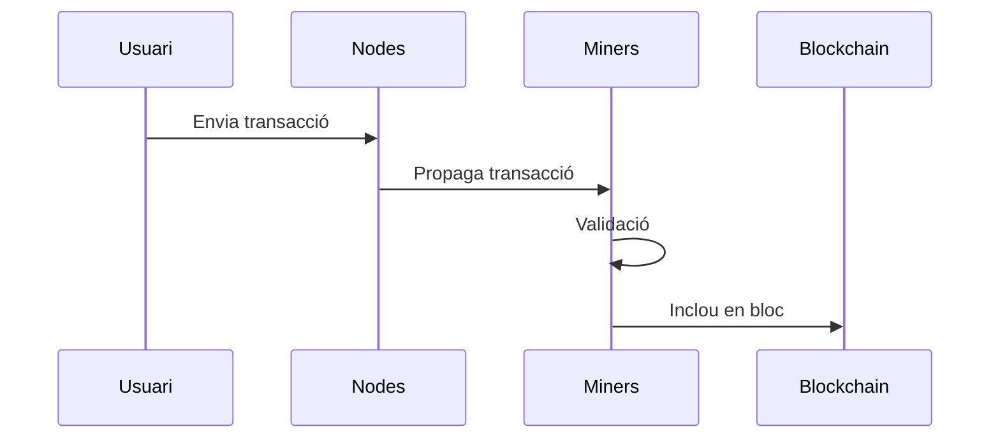

---

## Bloc de Bitcoin

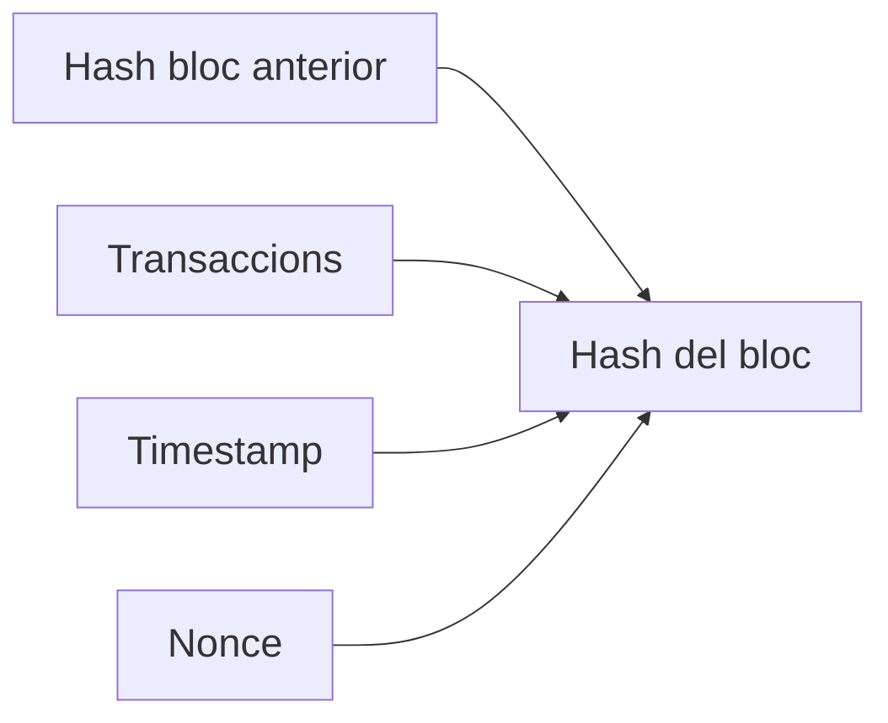

---

## Cadena de blocs

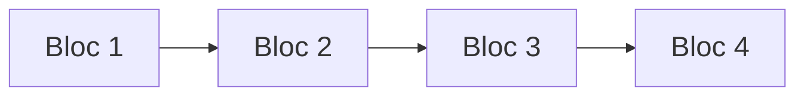

Propietat clau:

- si es modifica un bloc
- canvia el **hash**
- es trenca la cadena

➡️ **immutabilitat**

---

# Ethereum

---

## Ethereum

Blockchain programable.

Permet:

- **smart contracts**
- **dApps**
- **DeFi**
- **NFTs**

Creat per **Vitalik Buterin (2015)**

---

## Smart Contracts

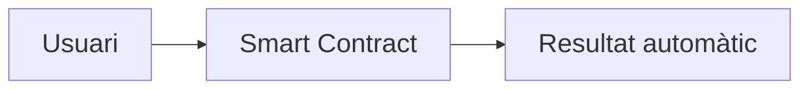

---

## Ethereum Virtual Machine

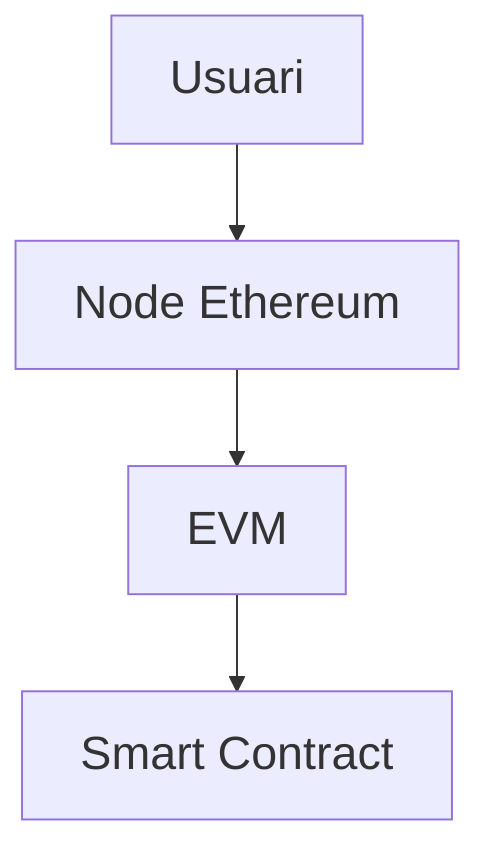

---

# Estructura de dades

---

## Blockchain com a registre append-only

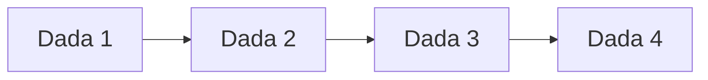

Propietats:

- només **afegir dades**
- no es poden modificar dades antigues

---

# Validació de transaccions

---

## Signatures digitals

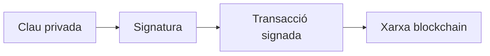

---

## Validació en la xarxa

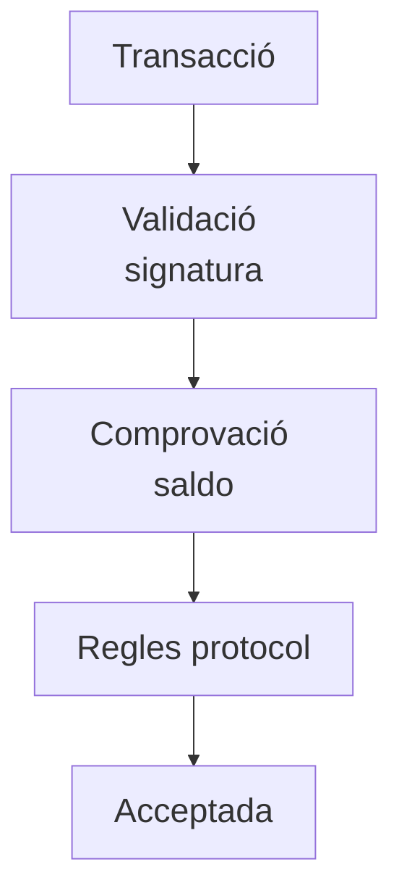

---

# Arquitectura d'una dApp

---

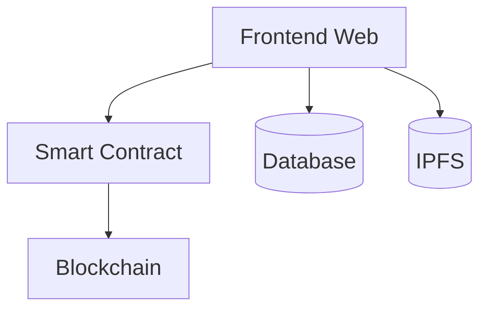

---

# Consens

---

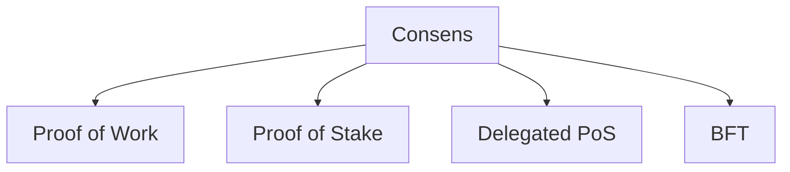

---

# Merkle Tree

---

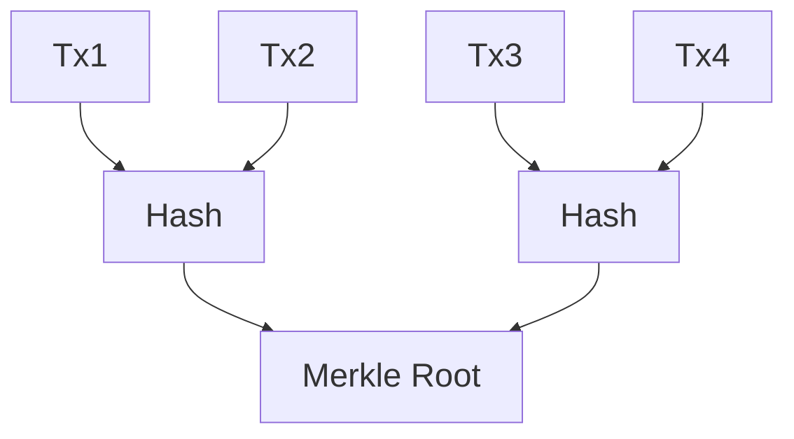

---

# Resum

Blockchain és:

- registre distribuït
- immutable
- verificable criptogràficament

Aplicacions:

- criptomonedes
- DeFi
- NFTs
- DAOs
- tokenització d'actius
