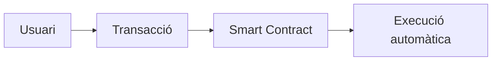
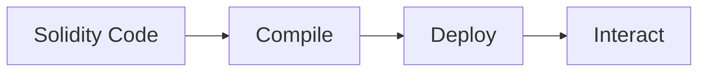

# Smart Contracts amb Solidity

---

## Objectius de la sessió

Aprendrem:

- què és un **smart contract**
- programació **bàsica amb Solidity**
- **tipus de dades**
- **estructures de dades complexes**
- usar **Remix**
- usar **Hardhat**
- compilar i desplegar contractes

---

# Què és un Smart Contract

---

## Definició

Un **smart contract** és un programa que:

- s'executa dins una **blockchain**
- defineix **regles automàtiques**
- s'executa **sense intermediaris**

Propietats:

- immutable
- transparent
- verificable

---

## Idea bàsica

<div style="width:65%; margin:auto;">



</div>

---

# Solidity

---

## Solidity

Solidity és el llenguatge per programar **smart contracts**.

Característiques:

- sintaxi semblant a **JavaScript**
- llenguatge **tipat**
- compilat a **bytecode EVM**

---

# Tipus de dades bàsics

---

## Integers

```solidity
uint256 public balance;
uint public counter;
int public temperature;
```

Tipus:

- `uint`
- `uint256`
- `int`

---

## Boolean

```solidity
bool public isActive = true;
```

Valors:

- `true`
- `false`

---

## Address

Representa una adreça Ethereum.

```solidity
address public owner;
```

Útil per:

- identificar usuaris
- enviar ETH

---

## String

```solidity
string public name = "Alice";
```

Strings s'usen per:

- noms
- metadades
- informació textual

---

# Arrays

---

## Arrays

```solidity
uint[] public numbers;

function addNumber(uint n) public {
    numbers.push(n);
}
```

Operacions:

- `push`
- `pop`
- accés per index

---

# Structs

---

## Struct

Permeten crear estructures de dades.

```solidity
struct Person {
    string name;
    uint age;
}
```

Útil per representar:

- usuaris
- registres
- objectes

---

## Exemple amb struct

```solidity
struct Person {
    string name;
    uint age;
}

Person public user;

function setUser(string memory _name, uint _age) public {
    user = Person(_name, _age);
}
```

---

# Mappings (HashMaps)

---

## Mapping

Un **mapping** és similar a un **hashmap**.

```solidity
mapping(address => uint) public balances;
```

Clau → valor

---

## Exemple mapping

```solidity
mapping(address => uint) public balances;

function deposit() public payable {
    balances[msg.sender] += msg.value;
}
```

---

# Exemple complet

```solidity
pragma solidity ^0.8.20;

contract Bank {

    mapping(address => uint) public balances;

    function deposit() public payable {
        balances[msg.sender] += msg.value;
    }

    function withdraw(uint amount) public {
        require(balances[msg.sender] >= amount);
        balances[msg.sender] -= amount;
        payable(msg.sender).transfer(amount);
    }

}
```

---

# Remix IDE

---

## Remix

Remix és un **IDE web per Solidity**.

https://remix.ethereum.org

Permet:

- escriure contractes
- compilar
- desplegar
- provar contractes

---

## Workflow Remix

<div style="width:70%; margin:auto;">



</div>

---

# Hardhat

---

## Hardhat

Hardhat és un **framework de desenvolupament Ethereum**.

Permet:

- compilar contractes
- executar tests
- desplegar contractes
- simular una blockchain local

---

## Instal·lació

```bash
npm install --save-dev hardhat
```

Crear projecte:

```bash
npx hardhat
```

---

# Estructura projecte Hardhat

```
project/
 ├ contracts/
 ├ scripts/
 ├ test/
 ├ hardhat.config.js
```

---

# Compilar contractes

```bash
npx hardhat compile
```

El compilador:

- genera **ABI**
- genera **bytecode**

---

# Desplegar contracte

Exemple script:

```javascript
async function main() {

 const Contract = await ethers.getContractFactory("Counter");
 const contract = await Contract.deploy();

 await contract.deployed();

 console.log("Contract deployed:", contract.address);
}

main();
```

---

Executar deploy:

```bash
npx hardhat run scripts/deploy.js
```

---

# Resum

Hem vist:

- smart contracts
- Solidity
- tipus de dades
- structs
- mappings
- Remix
- Hardhat
- deploy de contractes
