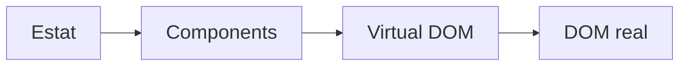

# Frontend amb React

---

## Objectius de la sessió

Aprendrem:

- què és **React**
- crear un projecte amb **Create React App**
- **JSX** i **components**
- **props** i **estat**
- **events** i formularis
- renderitzat **condicional** i **llistes**
- **useEffect** i crides a APIs
- **routing** amb React Router
- integració amb **Ethereum** (providers, MetaMask, contractes)
- estructura d'un **frontend de dapp**

---

# Què és React

---

## Definició

**React** és una **llibreria de JavaScript** per construir interfícies d'usuari.

Característiques:

- **declarativa**
  - Descrius què vol mostrar la UI segons l'estat, no com actualitzar-la pas a pas.
- basada en **components**
- **Virtual DOM**
  - Una representació lleugera del DOM en memòria (objectes JS).
  - Quan canvia l'estat, React crea un nou Virtual DOM, el compara amb l'anterior (__diffing__) i només aplica al DOM real els canvis mínims necessaris.
- gran **ecosistema**

---

## Idea bàsica

<div style="width:70%; margin:auto;">



</div>

L'estat de l'aplicació alimenta els components, que generen un Virtual DOM, i React el compara amb l'anterior per actualitzar només els canvis necessaris al DOM real.

---

# Preparació de l'entorn

---

## Node.js i npm

Necessitem **Node.js** instal·lat.

```bash
node --version
npm --version
```

`npm` és el gestor de paquets de Node.js.

---

## Create React App

Per crear un projecte nou:

```bash
npx create-react-app la-meva-app
```

Entrar al projecte:

```bash
cd la-meva-app
```

---

## Executar el projecte

```bash
npm start
```

Obre automàticament:

```
http://localhost:3000
```

Amb **hot reload** activat.

---

## Estructura del projecte

```
la-meva-app/
 ├ node_modules/
 ├ public/
 ├ src/
 │  ├ App.js
 │  ├ index.js
 │  └ index.css
 ├ package.json
```

---

# JSX

---

## Què és JSX

**JSX** és una extensió de JavaScript que permet escriure HTML dins del codi.

```jsx
const element = <h1>Hola, món!</h1>;
```

Es compila a crides de JavaScript.

---

## Diferències amb HTML

- `class` → `className`
- `for` → `htmlFor`
- atributs en **camelCase** (`onClick`, `onChange`)
- tags han d'estar **tancats**

```jsx
<input type="text" className="input" />
```

---

## Expressions dins JSX

Es poden posar expressions JavaScript amb `{}`:

```jsx
const name = "Alice";

const element = <h1>Hola, {name}!</h1>;
```

---

# Components

---

## Components funcionals

Un component és una **funció** que retorna JSX.

```jsx
function Welcome() {
  return <h1>Hola, món!</h1>;
}

export default Welcome;
```

---

## Importar components

```jsx
import Welcome from './Welcome';

function App() {
  return (
    <div>
      <Welcome />
    </div>
  );
}

export default App;
```

---

## Composició

Els components es poden combinar entre ells.

```jsx
function App() {
  return (
    <div>
      <Header />
      <Content />
      <Footer />
    </div>
  );
}
```

---

# Props

---

## Props

Les **props** permeten passar dades del pare al fill.

```jsx
function Welcome(props) {
  return <h1>Hola, {props.name}!</h1>;
}
```

Ús:

```jsx
<Welcome name="Alice" />
```

---

## Destructuring

```jsx
function Welcome({ name }) {
  return <h1>Hola, {name}!</h1>;
}
```

Més net i llegible.

---

## Exemple amb props

```jsx
function Card({ title, description }) {
  return (
    <div className="card">
      <h2>{title}</h2>
      <p>{description}</p>
    </div>
  );
}

<Card title="React" description="Llibreria UI" />
```

---

# Estat (useState)

---

## Què és l'estat

L'**estat** és informació que pot **canviar** dins d'un component.

Quan canvia, React **re-renderitza** el component.

---

## useState

```jsx
import { useState } from 'react';

function Counter() {
  const [count, setCount] = useState(0);

  return (
    <div>
      <p>Comptador: {count}</p>
      <button onClick={() => setCount(count + 1)}>+1</button>
    </div>
  );
}
```

---

# Events

---

## Gestió d'events

Els events s'escriuen en **camelCase**:

```jsx
<button onClick={handleClick}>Clica'm</button>
```

```jsx
function handleClick() {
  alert("Has clicat!");
}
```

---

## Formularis controlats

```jsx
function Form() {
  const [name, setName] = useState("");

  return (
    <div>
      <input
        value={name}
        onChange={(e) => setName(e.target.value)}
      />
      <p>Hola, {name}!</p>
    </div>
  );
}
```

---

# Renderitzat condicional

---

## Condicionals

Amb l'operador ternari:

```jsx
{isLogged ? <Dashboard /> : <Login />}
```

Amb `&&`:

```jsx
{hasError && <p>Error!</p>}
```

---

# Llistes

---

## Renderitzar llistes

S'usa `.map()` per generar elements.

```jsx
const fruits = ["poma", "plàtan", "taronja"];

<ul>
  {fruits.map((fruit, index) => (
    <li key={index}>{fruit}</li>
  ))}
</ul>
```

La prop `key` és **obligatòria**.

---

# useEffect

---

## useEffect

Permet executar codi després del render.

```jsx
import { useEffect, useState } from 'react';

function App() {
  const [data, setData] = useState(null);

  useEffect(() => {
    fetch("https://api.example.com/data")
      .then(res => res.json())
      .then(setData);
  }, []);

  return <div>{data ? data.name : "Carregant..."}</div>;
}
```

---

## Dependències

```jsx
useEffect(() => {
  // només al muntar
}, []);

useEffect(() => {
  // quan canvia count
}, [count]);
```

---

# Estils

---

## CSS

Es pot importar un fitxer CSS directament:

```jsx
import './App.css';

<div className="card">Hola</div>
```

També existeixen:

- **CSS Modules**
- **Styled Components**
- **Tailwind CSS**

---

# Routing

---

## React Router

Per tenir **múltiples pàgines** dins l'aplicació.

Instal·lació:

```bash
npm install react-router-dom
```

---

## Configuració bàsica

```jsx
import { BrowserRouter, Routes, Route } from 'react-router-dom';
import Home from './Home';
import About from './About';

function App() {
  return (
    <BrowserRouter>
      <Routes>
        <Route path="/" element={<Home />} />
        <Route path="/about" element={<About />} />
      </Routes>
    </BrowserRouter>
  );
}
```

---

## Links de navegació

```jsx
import { Link } from 'react-router-dom';

function Nav() {
  return (
    <nav>
      <Link to="/">Inici</Link>
      <Link to="/about">Sobre nosaltres</Link>
    </nav>
  );
}
```

A diferència de `<a>`, **no recarrega** la pàgina.

---

## Paràmetres de ruta

```jsx
<Route path="/user/:id" element={<User />} />
```

Llegir-los dins del component:

```jsx
import { useParams } from 'react-router-dom';

function User() {
  const { id } = useParams();
  return <h1>Usuari {id}</h1>;
}
```

---

## Navegació programàtica

```jsx
import { useNavigate } from 'react-router-dom';

function Login() {
  const navigate = useNavigate();

  function handleLogin() {
    navigate("/dashboard");
  }

  return <button onClick={handleLogin}>Entrar</button>;
}
```

---

# Integració amb Ethereum

---

## Frontend d'una dapp

Una **dapp** té dues parts:

- **Smart contract** desplegat a la blockchain (Solidity + Hardhat).
- **Frontend** (React) que hi interactua des del navegador.

El frontend necessita:

- connectar-se a la **wallet** de l'usuari (ex: MetaMask)
- saber l'**adreça** i l'**ABI** del contracte
- enviar-li **crides** i **transaccions**

---

## Variables d'entorn

Fitxer `.env` a l'arrel del projecte:

```text
REACT_APP_CONTRACT_ADDRESS=0x123...
REACT_APP_RPC_URL=https://sepolia.infura.io/v3/...
```

- Han de començar per `REACT_APP_` perquè Create React App les exposi.
- S'accedeixen amb `process.env.REACT_APP_CONTRACT_ADDRESS`.
- El `.env` **no** es puja al repositori (va al `.gitignore`).

---

## Provider i Signer

Amb **ethers.js**:

```bash
npm install ethers
```

- **Provider**: connexió de només lectura a la blockchain.
- **Signer**: pot **signar transaccions** (necessita la wallet de l'usuari).

```jsx
import { ethers } from "ethers";

const provider = new ethers.BrowserProvider(window.ethereum);
const signer = await provider.getSigner();
```

---

## Connexió amb MetaMask

MetaMask injecta `window.ethereum` al navegador.

```jsx
async function connectWallet() {
  if (!window.ethereum) {
    alert("Instal·la MetaMask!");
    return;
  }
  const accounts = await window.ethereum.request({
    method: "eth_requestAccounts",
  });
  console.log("Compte connectat:", accounts[0]);
}
```

---

## ABI del contracte

L'**ABI** (Application Binary Interface) descriu les funcions del contracte.

- El genera Hardhat quan compiles: `artifacts/contracts/MyContract.sol/MyContract.json`.
- Es copia al frontend, normalment a `src/abis/MyContract.json`.
- Sense l'ABI, el frontend no sap com cridar el contracte.

---

## Instanciar un contracte

```jsx
import { ethers } from "ethers";
import abi from "./abis/MyContract.json";

const address = process.env.REACT_APP_CONTRACT_ADDRESS;
const provider = new ethers.BrowserProvider(window.ethereum);
const signer = await provider.getSigner();

const contract = new ethers.Contract(address, abi, signer);
```

Ara `contract` té els mètodes del contracte com a funcions JS.

---

## Lectura vs Transacció

**Lectura** (`view` / `pure`): gratuïta, instantània.

```jsx
const value = await contract.getValue();
```

**Transacció** (modifica l'estat): costa **gas**, cal esperar que es mini.

```jsx
const tx = await contract.setValue(42);
await tx.wait(); // espera confirmació
```

---

## Events del contracte

El contracte pot emetre **events** que el frontend escolta:

```jsx
useEffect(() => {
  contract.on("ValueChanged", (newValue) => {
    console.log("Nou valor:", newValue);
  });

  return () => contract.removeAllListeners("ValueChanged");
}, []);
```

Útil per actualitzar la UI quan algú interactua amb el contracte.

---

## Estats de càrrega

Les transaccions triguen segons → cal mostrar-ho a l'usuari:

```jsx
const [loading, setLoading] = useState(false);

async function handleClick() {
  setLoading(true);
  try {
    const tx = await contract.setValue(42);
    await tx.wait();
  } catch (err) {
    console.error(err);
  } finally {
    setLoading(false);
  }
}
```

---

## Estructura típica d'un frontend de dapp

```text
frontend/
 ├ public/
 ├ src/
 │  ├ abis/              # ABIs del contracte
 │  ├ components/        # components React
 │  ├ hooks/             # useWallet, useContract...
 │  ├ utils/ethers.js    # provider, signer
 │  ├ App.js
 │  └ index.js
 ├ .env                  # adreça contracte, RPC
 ├ .gitignore
 └ package.json
```

---

## package.json

Defineix el projecte:

- **dependencies**: `react`, `ethers`, `react-router-dom`...
- **scripts**: `npm start`, `npm run build`, `npm test`.

```json
{
  "dependencies": {
    "react": "^18.2.0",
    "ethers": "^6.0.0",
    "react-router-dom": "^6.0.0"
  },
  "scripts": {
    "start": "react-scripts start",
    "build": "react-scripts build"
  }
}
```

---

## build/ i .gitignore

**`npm run build`** genera la carpeta `build/` amb els fitxers estàtics (HTML, CSS, JS) llestos per desplegar.

El `.gitignore` típic exclou:

```text
node_modules/
build/
.env
```

- `node_modules/` → es reinstal·la amb `npm install`.
- `build/` → es regenera.
- `.env` → pot contenir claus privades.

---

# Exemple complet

Llista de tasques:

```jsx
import { useState } from 'react';

function TodoApp() {
  const [tasks, setTasks] = useState([]);
  const [text, setText] = useState("");

  function addTask() {
    if (text === "") return;
    setTasks([...tasks, text]);
    setText("");
  }

  return (
    <div>
      <input value={text} onChange={(e) => setText(e.target.value)} />
      <button onClick={addTask}>Afegir</button>
      <ul>
        {tasks.map((task, i) => <li key={i}>{task}</li>)}
      </ul>
    </div>
  );
}
```

---

# Resum

Hem vist:

- què és React
- Create React App
- JSX
- components i props
- estat amb `useState`
- events i formularis
- renderitzat condicional i llistes
- `useEffect`
- routing amb React Router
- integració amb Ethereum (ethers.js, MetaMask, ABI, contractes)
- estructura d'un frontend de dapp

---

## React JS - React Tutorial for Beginners

<!-- markdownlint-disable MD033 -->
<iframe width="560" height="315" src="https://www.youtube.com/embed/Ke90Tje7VS0?si=tafNuvBEb3co4dWr" title="YouTube video player" frameborder="0" allow="accelerometer; autoplay; clipboard-write; encrypted-media; gyroscope; picture-in-picture; web-share" referrerpolicy="strict-origin-when-cross-origin" allowfullscreen></iframe>
<!-- markdownlint-enable MD033 -->
