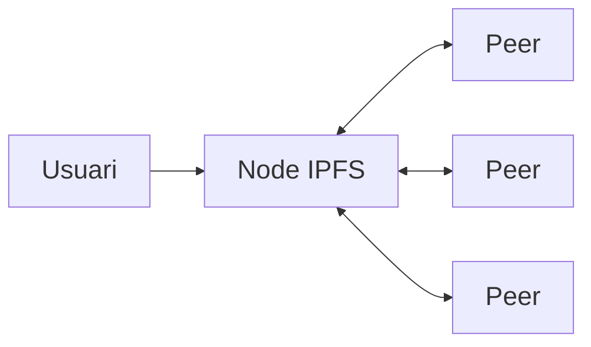

# Emmagatzematge amb IPFS

---

## Objectius de la sessió

Aprendrem:

- què és **IPFS** i per què el necessitem
- què és un **CID**
- com funciona IPFS a alt nivell
- **pinning** i serveis com **Pinata**
- com **pujar un fitxer a IPFS des de React** i obtenir-ne el CID

---

# Què és IPFS

---

## Definició

**IPFS** (*InterPlanetary File System*) és un **protocol peer-to-peer** per emmagatzemar i compartir fitxers de manera **distribuïda**.

- **Descentralitzat**: no depèn d'un servidor central.
- **Adreçament per contingut**: els fitxers s'identifiquen pel seu **hash**, no per la seva ubicació.
- **Resistent a la censura**: el contingut es pot replicar entre molts nodes.

---

## El problema de l'HTTP

A la web tradicional, una URL apunta a una **ubicació**:

```text
https://exemple.com/foto.png
```

- Diu **on** és el fitxer.
- Si el servidor cau, el fitxer **desapareix**.
- Si algú modifica el fitxer, l'URL **continua igual**.

---

## La idea d'IPFS

A IPFS, l'identificador d'un fitxer és el seu **hash**:

```text
ipfs://QmXoypizjW3WknFiJnKLwHCnL72vedxjQkDDP1mXWo6uco
```

- Diu **què** és el fitxer.
- No importa **qui** el serveix.
- Si el contingut canvia, l'identificador **canvia**.

---

# CID

---

## Què és un CID

Un **CID** (*Content Identifier*) és l'identificador d'un fitxer a IPFS.

És essencialment un **hash** del contingut:

```text
QmXoypizjW3WknFiJnKLwHCnL72vedxjQkDDP1mXWo6uco
```

Propietats:

- el mateix fitxer **sempre** dóna el mateix CID
- fitxers diferents donen CIDs diferents
- garanteix **integritat**: pots verificar que el que reps és el que esperaves

---

# Com funciona IPFS

---

## Xarxa P2P

<div style="width:60%; margin:auto;">



</div>

- Cada usuari pot tenir un **node IPFS**.
- Els nodes es connecten entre ells.
- Quan demanes un CID, IPFS **busca quin peer el té** i te'l descarrega.

---

## Pinning

Per defecte, el contingut només sobreviu si **algun node** el manté.

**Pin** = marcar un fitxer perquè el teu node **el conservi**.

Si ningú el "pin"-eja, pot **desaparèixer** de la xarxa.

---

## Serveis de pinning

Empreses que mantenen els teus fitxers a IPFS sempre disponibles:

- **Pinata** (`pinata.cloud`)
- **Web3.Storage**
- **NFT.Storage**
- **Infura IPFS**

És la manera més pràctica de pujar fitxers a IPFS sense haver d'instal·lar res.

---

## Gateways

Un **gateway** és un servidor HTTP que permet veure contingut IPFS des del navegador:

```text
https://gateway.pinata.cloud/ipfs/QmXoy...
https://ipfs.io/ipfs/QmXoy...
```

Així, qualsevol persona amb un navegador pot accedir al fitxer **sense instal·lar IPFS**.

Exemple real (proveu d'obrir-lo):

```text
https://gateway.pinata.cloud/ipfs/QmbWqxBEKC3P8tqsKc98xmWNzrzDtRLMiMPL8wBuTGsMnR
```

---

# IPFS i dapps

---

## Per què IPFS en una dapp

Guardar fitxers grans (imatges, vídeos, JSON...) directament a la blockchain és **caríssim**.

Solució habitual:

1. Pugem el fitxer a **IPFS** → obtenim un **CID**.
2. Guardem només el **CID** al **smart contract**.
3. El frontend recupera el CID i descarrega el fitxer per un gateway.

---

# Pujar a IPFS des de React

---

## Pinata

Farem servir **Pinata** com a servei de pinning. Passos:

1. Crear un compte a [pinata.cloud](https://pinata.cloud).
2. Generar una **API Key** (secció *API Keys* → *New Key*).
3. Copiar el **JWT** (*secret access token*) que ens dóna.
4. Guardar-lo en una variable d'entorn al projecte React.

---

## Variables d'entorn

Fitxer `.env` a l'arrel del projecte React:

```text
REACT_APP_PINATA_JWT=eyJhbGciOiJIUzI1NiIsInR5...
```

- Ha de començar per `REACT_APP_` perquè Create React App l'exposi.
- Afegir `.env` al `.gitignore` (la clau és **privada**).

---

## Component d'upload

```jsx
import { useState } from 'react';

function IpfsUpload() {
  const [cid, setCid] = useState(null);
  const [loading, setLoading] = useState(false);

  async function handleChange(event) {
    const file = event.target.files[0];
    if (!file) return;

    setLoading(true);

    const formData = new FormData();
    formData.append("file", file);

    const res = await fetch(
      "https://api.pinata.cloud/pinning/pinFileToIPFS",
      {
        method: "POST",
        headers: {
          Authorization: `Bearer ${process.env.REACT_APP_PINATA_JWT}`,
        },
        body: formData,
      }
    );

    const data = await res.json();
    setCid(data.IpfsHash);
    setLoading(false);
  }

  return (
    <div>
      <input type="file" onChange={handleChange} />
      {loading && <p>Pujant...</p>}
      {cid && (
        <div>
          <p>CID: {cid}</p>
          <a
            href={`https://gateway.pinata.cloud/ipfs/${cid}`}
            target="_blank"
            rel="noreferrer"
          >
            Veure fitxer
          </a>
        </div>
      )}
    </div>
  );
}

export default IpfsUpload;
```

---

## Què fa pas a pas

1. L'usuari selecciona un fitxer amb `<input type="file">`.
2. Construïm un `FormData` amb el fitxer.
3. Fem un `POST` a `api.pinata.cloud/pinning/pinFileToIPFS` amb el JWT a la capçalera.
4. Pinata respon amb un JSON que conté el camp **`IpfsHash`** → aquest és el **CID**.
5. Mostrem el CID i un enllaç al gateway per veure el fitxer.

---

## Mostrar una imatge pujada

Si el fitxer és una imatge, podem mostrar-la directament:

```jsx
{cid && (
  
)}
```

Exemple amb un CID real:

```jsx

```

---

## Combinant amb un smart contract

Cas típic en una dapp: pujar a IPFS i guardar el CID al contracte.

```jsx
async function handleUpload(file) {
  // 1. Pujar a IPFS
  const formData = new FormData();
  formData.append("file", file);

  const res = await fetch(
    "https://api.pinata.cloud/pinning/pinFileToIPFS",
    {
      method: "POST",
      headers: { Authorization: `Bearer ${process.env.REACT_APP_PINATA_JWT}` },
      body: formData,
    }
  );
  const { IpfsHash: cid } = await res.json();

  // 2. Desar el CID al contracte
  const tx = await contract.setCid(cid);
  await tx.wait();

  console.log("Guardat al contracte:", cid);
}
```

---

# Resum

Hem vist:

- què és **IPFS** i per què és útil
- l'**adreçament per contingut** i els **CIDs**
- la xarxa **P2P**, el **pinning** i els **gateways**
- com **pujar un fitxer a IPFS des de React** amb **Pinata**
- com recuperar el **CID** i mostrar el contingut
- com combinar IPFS amb un **smart contract** en una dapp

---

## IPFS Tutorial - Decentralized Storage

<!-- markdownlint-disable MD033 -->
<iframe width="560" height="315" src="https://www.youtube.com/embed/5Uj6uR3fp-U" title="YouTube video player" frameborder="0" allow="accelerometer; autoplay; clipboard-write; encrypted-media; gyroscope; picture-in-picture; web-share" referrerpolicy="strict-origin-when-cross-origin" allowfullscreen></iframe>
<!-- markdownlint-enable MD033 -->
